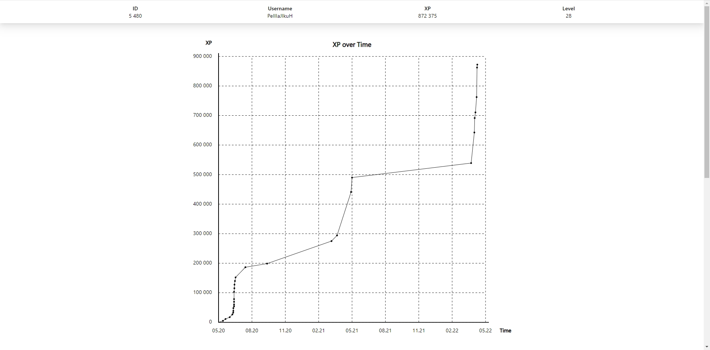
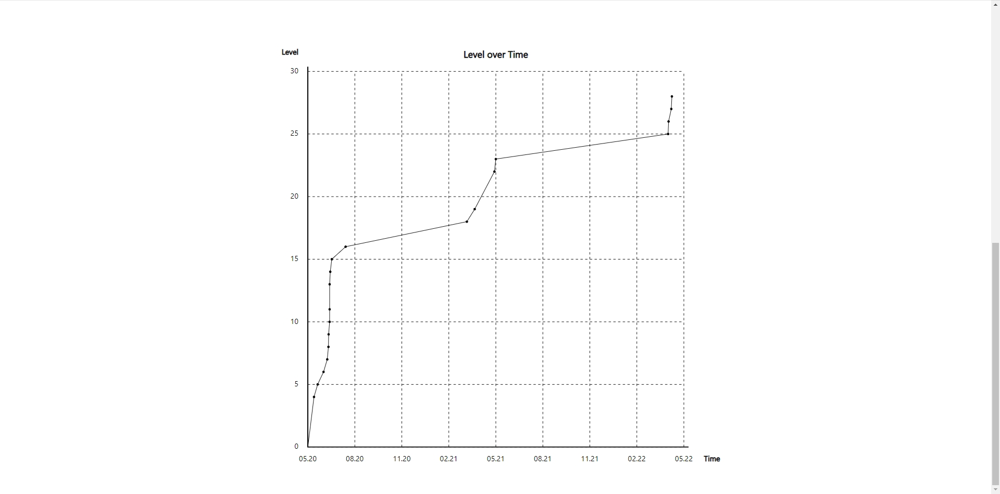

# Graphql

## Project starting

- Real Time Forum requires [Node.js](https://nodejs.org/) to run.
- Make sure that you have the latest LTS version of node.
- Open terminal instance in the root folder:

```sh
npm install
npm run dev
```

- Now open the http://localhost:3000 on any browser you want.

## Screenshots

- XP chart
  
- Level chart
  
